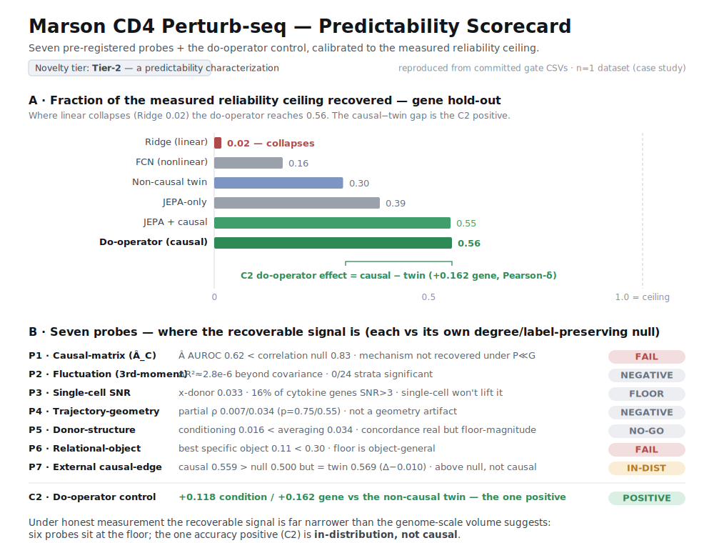

# The Predictability Audit — a scorecard reframe of the Marson CD4 Perturb-seq work (candidate v2)

*Developer 2, autonomous, AFK-safe. This prepares a **candidate v2** submission: an honest reframe of
everything already validated — the seven pre-registered probes + the predictability budget + the
do-operator positive control — assembled into a **dataset predictability scorecard**. It is **not an eighth
model** (seven investigations proved that model does not exist at this depth); it is an **evaluation/methods
reframe** of existing, committed, validated content. The frozen submission (`submission-fallback-v1` /
`6476670`) is byte-untouched. **One strategic decision is left for the lead: promote v2 or keep v1** (see
the end). Nothing here is merged; this is a PR-for-review on `predictability-audit`.*

---

## What this is (and is not)
- **Is:** a reproducible **audit** that measures *how predictable the Marson CD4 dataset actually is* — the
  intrinsic ceiling, the noise floor, and which kinds of structure (pointwise, mechanistic, donor,
  relational, trajectory, external-causal) carry recoverable signal vs. which sit at the floor — each scored
  against a degree/label-preserving null, with the do-operator as a signal-detection anchor.
- **Is not:** a new predictor. If the hackathon strictly rewards a more accurate model, **this is not that**
  — that model was proven not to exist here, seven times. It wins on the axis the field has *explicitly
  asked for* (assessing dataset/causal validity beyond accuracy) and on the honesty of the negative-space
  map. **Whether that axis counts is the lead's call.**

## Paradigm lineage (cited, not invented)
Intrinsic **predictability / forecastability** is an established paradigm — the property of a *system/dataset*
that bounds any model, distinct from any one model's error. It comes from ecology and time-series
forecasting (e.g. Pennekamp et al., *the intrinsic predictability of ecological time series*; spectral-entropy
forecastability measures). **We claim only the instantiation** — porting that paradigm to a Perturb-seq
dataset — **not the concept.** *(Exact paradigm citations to be firmed up before any external use; provided
as a pointer by the brief.)* This is **not** "ImageNet/GLUE for cells": it is a validated audit on one
(possibly two) dataset(s) — a seed, not a finished standard.

## Step 0 — occupancy check → **novelty Tier-2** (conservative)
Full-text/preprint reads of the four most-likely occupiers (parallel agents; sources below). The question:
does any of them profile a **dataset's own intrinsic predictability** (a ceiling/audit), vs. ranking models?

| Work | What it does | Profiles dataset predictability? |
|---|---|---|
| **scPerturBench** (Nat. Methods 2025, 10.1038/s41592-025-02980-0) | Ranks **27 models** across 29 datasets on 6 model-vs-truth metrics | **No** — model ranking; no per-dataset ceiling (full text paywalled, so not 100% excluded) |
| **"A Systematic Comparison…"** (bioRxiv 10.1101/2024.12.23.630036) | Separate model benchmark (12 methods, 25 datasets) | **No** — attributes failure to "heterogeneity" but computes no ceiling |
| **CIPHER** (Kuznets-Speck et al., bioRxiv 2025.06.27.661814) | Linear-response model; predicts outcomes from baseline covariance | **Ambiguous** — correlates a per-dataset structural property (participation ratio) with predictability (R²=0.75, slope −6.5) across 11 datasets |
| **"Virtual Cells as Causal World Models"** (OpenReview qjIq4JWFVs) | Proposes a causal-eval taxonomy; **calls for** benchmarks | **No — and cited as the field's own request** for exactly this |
| **PerturbPlan** | Pre-data experiment **design/power** tool | **No** — before data exists, not a post-hoc audit |

**Tier decision: Tier-2 — "a predictability characterization of the Marson CD4 dataset."** Three of four are
clean non-occupants; all four agents independently returned *occupies_lane = false*. But **CIPHER** maps a
per-dataset structural quantity to predictability (verbatim: *"datasets with relatively high participation
ratios correspondingly exhibited lower R2 values (correlation R2 = 0.75; slope = -6.5)"*), which is close
enough to dataset-difficulty profiling that a **"first"** claim is not safely defensible — and scPerturBench's
paywalled full text cannot be fully excluded. The conservative rule sends this to **Tier-2**. *(A Tier-1
reading is arguable — CIPHER's participation ratio is a complexity/dimensionality construct, not an
irreducible-noise ceiling — but we do not overclaim on incomplete reads.)*

**Weak vs strong occupation — the pivot for the promote call: WEAK.** Verified against CIPHER's full text
(Kuznets-Speck et al.; bioRxiv 2025.06.27.661814 / Research Square 10.21203/rs.3.rs-7304871, PMC12363937),
**CIPHER does *not* define a model-agnostic predictability ceiling.** Its one cross-dataset result —
*verbatim:* "datasets with relatively high participation ratios correspondingly exhibited lower R2 values
(correlation R2 = 0.75; slope = −6.5)" — is a property of **its own linear method's** performance, not an
irreducible noise floor that bounds any model. scPerturBench (10.1038/s41592-025-02980-0) ranks 27 models
with **no** per-dataset ceiling and factors in only because its full text is paywalled. **No existing
single-cell predictability-*ceiling* method was found.** So this is weak occupation: a reliability-ceiling-
calibrated, positive-control-anchored, **seven-orthogonal-probe** scorecard is a clear step beyond a single
structural↔performance correlation — the contribution is **real at Tier-2** (Tier-1 is defensible), just not
safely labeled "first."

> Note: **CIPHER is the fluctuation/response-theory paper that probe P2 tested.** CIPHER predicts from the
> *covariance* (2nd moment); our P2 asked whether the *third* moment adds anything beyond covariance on real
> data → **negative** (0/24 strata). So this audit is adjacent to and consistent with CIPHER, not a competitor.

## G-PA.1 — the scorecard reproduces the committed verdicts: **PASS (faithful audit)**
`predictability_audit/` packages the seven probes + budget + do-operator control behind one
`run_audit("marson")` entry point. It is **stdlib-only** (no pandas), **does not retrain**, and **never
imports or modifies the frozen `core.eval`** — it reads the committed gate CSVs (ground truth), re-derives
each verdict from that probe's score + null + floor, and **self-checks against the committed verdict**.

**Result: 7/7 probes reproduced faithfully; the do-operator C2 control registers POSITIVE.** Packaging did
not change any answer. (Anti-triviality: no cell is reproducible by a trivially smoother/higher-SNR
reference — P1 is scored against a correlation null, P7 against its non-causal twin, the rest against
degree/label-preserving permutation nulls.)

### The Marson scorecard (`results/predictability_audit_gate.csv`)

| Probe | Question | Verified reading | Verdict |
|---|---|---|---|
| **P1 Causal-matrix (Â_C)** | Does an explicit per-context causal matrix beat correlation under P≪G? | AUROC **0.62 < correlation-null 0.83** (oracle 1.00) | **FAIL** |
| **P2 Fluctuation (3rd-moment)** | Does the response 3rd moment predict what covariance cannot? | ΔR² ≈ **2.8e-6**, **0/24** strata significant | **NEGATIVE** |
| **P3 Single-cell SNR** | Would single-cell depth lift the pointwise floor? | x-donor **0.033**; **16%** cytokine genes SNR>3; gate RED | **NOISE-FLOOR** |
| **P4 Trajectory-geometry** | Is recoverability a trajectory-geometry artifact? | partial ρ **0.007 / 0.034** (p=0.75 / 0.55) | **NEGATIVE** |
| **P5 Donor-structure** | Does donor-conditioning beat donor-averaging? | conditioning **0.016 < averaging 0.034** | **NO-GO** |
| **P6 Relational-object** | Does any relational object reach 0.30? | best specific object **0.11 < 0.30** | **FAIL** |
| **P7 External causal-edge** | Is the edge recovery causal, or predictive? | causal **0.559 > null 0.500** but **= twin 0.569 (Δ−0.010)** | **IN-DISTRIBUTION** |
| **Budget (ceiling+floor)** | How much is recoverable; where does linear collapse? | floor **0.032/0.049** (perm_p 0); Ridge **0.02** vs do-op **0.56** of ceiling (gene) | floor real, small |
| **C2 Do-operator control** | Does the null machinery ever register a positive? | **+0.118 cond / +0.162 gene** vs twin | **POSITIVE** |

## The finding (the reframe)
Under honest measurement — every probe scored against its own degree/label-preserving null and read relative
to the measured reliability ceiling — **the recoverable signal is far narrower than the raw genome-scale
volume suggests.** Six probes sit at the noise floor or below a trivial reference; the **one accuracy
positive (C2) is in-distribution, not causal** (P7: it does not transfer to held-out external causal edges).

**The positive-control argument (why this is a map, not a failure):** the *same* null machinery that flags
six negatives + one in-distribution result still registers the do-operator C2 as a clear **positive**. So a
null cell means **"no signal here," not "no sensitivity"** — the instrument detects signal when signal
exists. That is what turns a pile of negatives into a *calibrated predictability map*.

## G-PA.2 — second-dataset port: **deferred → claim stays "characterization of Marson" (case study)**
Not attempted, by design. A second dataset (candidate CausalBench RPE1/K562) does **not** ingest cheaply
AFK, and cell lines are **structurally degenerate** for this suite: they have **no donors** (P5 inapplicable)
and **no activation trajectory** (P4 inapplicable), and P7 would need a **fresh do-operator retrain + external
edges** for that dataset — explicitly out of AFK scope (no retrain). Running only the applicable probes would
require the ingested data we do not have here.

**Consequence (honest):** the instrument claim is **not** yet earned. The word "instrument" requires a clean
port; until one exists, the claim is **"a predictability characterization of the Marson CD4 dataset"** — a
**case study (n=1)**. The port is future work. *(This does not block v2 — v2 stands on the Marson scorecard +
reframe.)*

## Honest ceilings
1. **Evaluation/methods contribution, not a new predictor.** Wins on dataset/causal-validity assessment and
   honesty of the negative-space map — the axis the field asked for — not on accuracy.
2. **Generalization is the real risk.** Demonstrated on **n=1** dataset ⇒ a case study. The likely cell-line
   second datasets cannot fully provide a clean port (P4/P5 degenerate). Do not overclaim "instrument."
3. **Cite the paradigm, claim the instantiation.** Intrinsic predictability is from ecology/forecasting; we
   instantiate it for Perturb-seq. Not "ImageNet/GLUE for cells."
4. **Every external number verified or flagged.** P7's 6,122 Freimer KO-DE + 45 Weinstock **direct** edges
   come from the C-FUSE report (`fusion-gates`, `882e12c`), kept separate from any Freimer full-text read;
   **Weinstock = Joshua S. Weinstock (PMC11605694), NOT "emdann"** (Emma Dann, a different researcher). C2
   verified against `results/benchmark_table.csv` (+0.118/+0.162); the floor 0.03 against
   `results/budget_cross_donor.csv` (0.032/0.049).

## Corrections where the repo/papers overrode the brief (they win)
- **`runs/<model>_<split>.parquet` are not committed** (they lived in the clobbered `DATA_ROOT`) — the
  scorecard reproduces from the committed **CSVs**, not raw run parquets.
- **No `core/residual.py|trajectory.py|donor.py|relational.py|fusion.py`** — the probes are **scripts**; their
  verdicts are committed CSVs. `predictability_audit/` packages those CSV verdicts, not nonexistent modules.
- **Novelty is Tier-2, not Tier-1** — CIPHER's per-dataset participation-ratio↔R² result and scPerturBench's
  paywalled text make "first" unsafe.

---

## The one decision left for the lead: **promote v2, or keep v1?**

**Recommendation: prepare v2 and (softly) lean toward promoting it — but the call is yours.** Rationale:
- **For promoting v2:** it is a **strictly better-framed submission of the same validated content.** It turns
  seven negatives + a positive control into one coherent, novel-at-Tier-2 contribution — a *predictability
  scorecard* — on the exact axis the field's own papers ask for ("Virtual Cells as Causal World Models" calls
  for causal-validity metrics; nobody has built the dataset audit). G-PA.1 is faithful; the frozen v1 remains
  the safe fallback.
- **For keeping v1:** if the hackathon strictly rewards accuracy, or if Tier-2 (not "first") + n=1 (case
  study, no clean instrument port) is judged too thin to outweigh v1's concrete do-operator result.

**This run does not make that call.** v2 is prepared on `predictability-audit` as a PR-for-review; the frozen
tag `6476670` and CP2 are byte-untouched; no v2 release is cut; nothing is merged.
