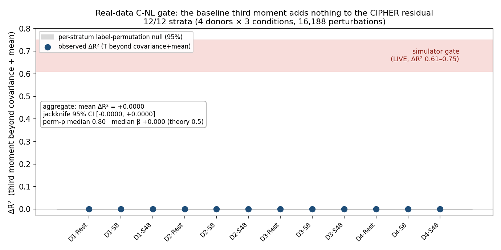

# C-NL Gate on Real Data — does the baseline third moment predict what covariance cannot?

**Verdict: negative, confirmed across all 12 strata.** On real CD4⁺ CRISPRi data the baseline
third moment is orthogonal to the CIPHER first-order residual; it carries no information that the
control-cell covariance does not already contain. This is the opposite of the synthetic C-NL gate
([FINDINGS_CNL.md](FINDINGS_CNL.md)), which was live (ΔR² +0.61…+0.75). The idea does not transfer.

This is the go/no-go decision that the simulator result deferred to the project lead. The answer is a
no-go for a third-moment closed-form on real CD4 data.

## 0. Provenance discipline (unchanged from the simulator gate)

The motivating physics claim is an inference, not a cited result, and is treated as such throughout:

- **Verified (CIPHER):** CIPHER's model is exactly first-order, `ΔX = Σu`, where `Σ` is the covariance of
  unperturbed control cells **in raw absolute counts** and `u` the perturbation input;
  `u*_i = (Σ_i·ΔX)/(Σ_i·Σ_i)`, `R² = 1 − ‖ΔX − Σu‖²/‖ΔX‖²`. (bioRxiv 2025.06.27.661814; PMC12363937.)
- **Not in CIPHER:** the words "third moment / cumulant / skew / susceptibility" never appear; CIPHER does
  not attribute its linear-response breakdown to any third-moment correction.
- **The inference (tested here, not cited):** second-order fluctuation–response theory identifies the leading
  correction to `Σu` as a contraction of the baseline third cumulant with the perturbation,
  `ΔX = Σu + ½·T[u,u] + O(u³)`, whose single-gene diagonal slice is `u*_k²·T_ikk`. The coefficient β is
  **fit, never assumed** (theory would place it at ½); the test asks only whether that feature explains
  residual variance that covariance and mean do not.

## 1. What was run

A single streamed pass was made over each donor×condition `assigned_guide` single-cell file (raw counts,
HVG=3000), computing the following in one sweep over control cells:

- `Σ` — the raw-count control covariance (CIPHER's first-order operator),
- `μ` — the control mean,
- `T_ikk = E[δx_i · δx_k²]` — the diagonal third-moment slice, obtained via raw moments in the same pass
  (`M = Xᵀ(X[:,pert]²)`, centralised analytically; the 3000³ tensor is never materialised),
- per-perturbation raw `ΔX` from the targeting cells of the same file.

Control is defined by `guide_type == non-targeting`; targeting cells are single-guide, non-multi, with
≥100 cells/perturbation; `low_quality` cells are excluded. Donor and condition are taken from the filename,
because the single-cell obs carry no `donor_id`.

**The gate** (`scripts/size_cnl_residual_cipher.py --cnl`) computes the incremental ΔR² of the third-moment
feature `u*_k²·T_ikk` on the first-order residual `r = ΔX − u*_k·Σ[:,k]`, **beyond** a covariance+mean null
`{Σ_ik, Σ_ik², (Σ²)_ik, μ_i, μ_iμ_k, μ_iμ_k²}`, via per-perturbation demeaning and Frisch–Waugh partialling,
with a **label-permutation null** (shuffle k→r) and a **leave-one-stratum-out jackknife** CI. A cov-only
variant (dropping the mean terms) is reported alongside. The gate was first validated on synthetic signal
(fires ΔR² 0.56, p 0.003; null 0.0003, p 0.50).

## 2. Result — 12/12 strata null

**Aggregate (4 donors × {Rest, Stim8hr, Stim48hr}, 16,188 perturbations):**

| scope | mean ΔR² | jackknife 95% CI | median β (theory ½) | perm-p (median) |
|-------|---------:|:----------------:|:-------------------:|:---------------:|
| full (cov + mean null) | **+0.0000** | [−0.0000, +0.0000] | +0.000 | 0.80 |
| trans-only | +0.0000 | [−0.0000, +0.0000] | +0.000 | 0.78 |

Every individual stratum is null: per-stratum ΔR² ∈ {+0.0000, +0.0001}, correlation of the third-moment
feature with the residual `raw_corr ∈ [−0.004, +0.009]`, `perm_p ∈ [0.30, 1.00]`. Crucially, the feature is
**well-formed everywhere** (`|F| = 0.03–0.14`), so the null reflects a genuine orthogonality rather than a
degenerate or all-zero feature. See `results/cnl_realdata_gate.png` and `results/cnl_realdata_gate.csv`.



### There is room — the third moment simply does not fill it

The first-order model leaves a substantial amount unexplained, so the null does not arise from an absence of
structure to explain:

| effect-size bin | n | median ‖ΔX‖ | residual fraction | first-order R² |
|-----------------|---:|-----------:|------------------:|---------------:|
| Q1 (smallest) | 3238 | 13.5 | 0.940 | 0.117 |
| Q2 | 3237 | 18.9 | 0.916 | 0.161 |
| Q3 | 3238 | 23.9 | 0.907 | 0.177 |
| Q4 | 3237 | 30.9 | 0.889 | 0.209 |
| Q5 (largest) | 3238 | 47.0 | 0.886 | 0.215 |

The aggregate residual fraction is 0.910 (R² 0.173). The residual shrinks with effect size (CIPHER fits
large effects best), but the diagonal third-moment term explains **none** of the widened gap in any regime.
This contrasts with the simulator, where the same feature captured approximately 0.6–0.75 of the residual
variance.

### Donor-reproducible bonus finding: the linear model degrades under stimulation

The first-order fit is markedly worse in stimulated cells, and this replicates in every donor:

| condition | R² (median across donors) | residual fraction |
|-----------|:-------------------------:|:-----------------:|
| Rest | ~0.30–0.37 | ~0.79–0.84 |
| Stim8hr | ~0.09–0.11 | ~0.94–0.95 |
| Stim48hr | ~0.10–0.15 | ~0.92–0.94 |

The response therefore moves further from linear the more the cells are perturbed — a real, repeatable
structural feature worth noting — yet the third moment still contributes zero to that larger residual.

## 3. Interpretation

The synthetic gate operated in a symmetric-A equilibrium where `Σu` is exact and the leading correction is
*exactly* the third-cumulant contraction. Real CD4 control-cell fluctuations do not satisfy those
conditions: the residual left by `Σu` is dominated by measurement noise, non-equilibrium and non-stationary
structure, and far-from-linear biology, rather than the smooth second-order fluctuation–response term. The
third moment is a faithful summary of unperturbed fluctuations; it is simply not what the perturbation
residual is composed of here.

This is consistent with the two earlier mechanism-recovery spikes ([FINDINGS.md](FINDINGS.md),
[FINDINGS_SPIKE2.md](FINDINGS_SPIKE2.md)): a construct that is clean and identifiable in the simulator
(oracle 1.0 there; live here) does not survive contact with real single-cell estimation error.

## 4. Reproduction

```bash
# per stratum (downloads one 110–161 GiB assigned_guide h5ad, scores, deletes raw):
python scripts/size_cnl_residual_cipher.py --cnl \
    --genes hvg --cnl-out results/cnl_realdata_gate.csv
# resumable: strata already in the CSV are skipped; per-stratum Σ+T+ΔX checkpoints
# (results/cnl_ckpt_<donor>_<cond>.npz, ~230 MB each) allow instant re-analysis with no re-download.
```

The analysis is run on an in-region AWS box (public S3 bucket `genome-scale-tcell-perturb-seq/marson2025_data/`,
`aws s3 --no-sign-request`). The full 12-strata sweep takes approximately 7.4 h wall time (download-bound).
Checkpoints are retained off-repo on the compute box, so any variant probe below is instant.

## 5. Scope, and the variant probes (considered and declined)

The negative result applies specifically to the **diagonal** third-moment slice `T_ikk` at approximately
76k–88k control cells per stratum. Three further degrees of freedom exist and were **considered and
declined**, not run:

- **full off-diagonal `T[u,u]`** rather than the single-gene diagonal slice,
- **denoised / low-rank `T`** to suppress third-moment estimation noise,
- **per-condition rather than pooled** modelling.

These are declined on the **orthogonality** evidence, not on cost: the diagonal feature is not merely weak,
it is *orthogonal* to the residual (`raw_corr ≈ 0`, `perm_p` non-significant) in all 12 strata. A different
contraction of the same third-moment object cannot concentrate signal that is not present, so there is
nothing to rescue. Running checkpoint-cheap variants against an orthogonal result would be effort spent
because it is cheap, not because it is informative. The construction of a third-moment closed-form for real
CD4 data is **not recommended**, and **this line is closed**: spikes #1/#2 (FAIL) → simulator gate (live) →
real data (negative).
